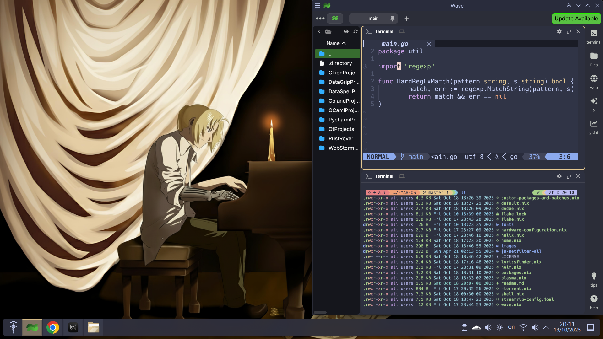
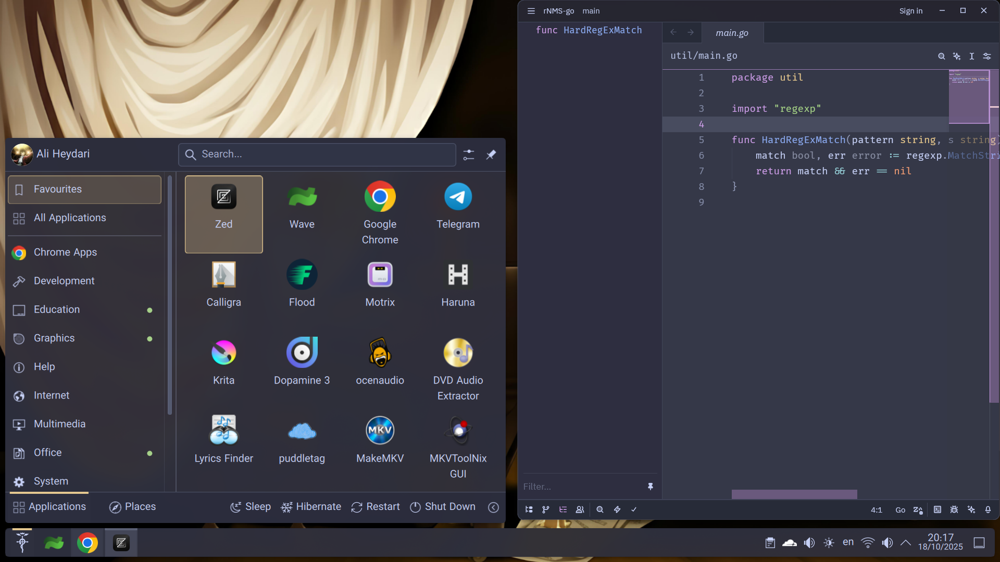
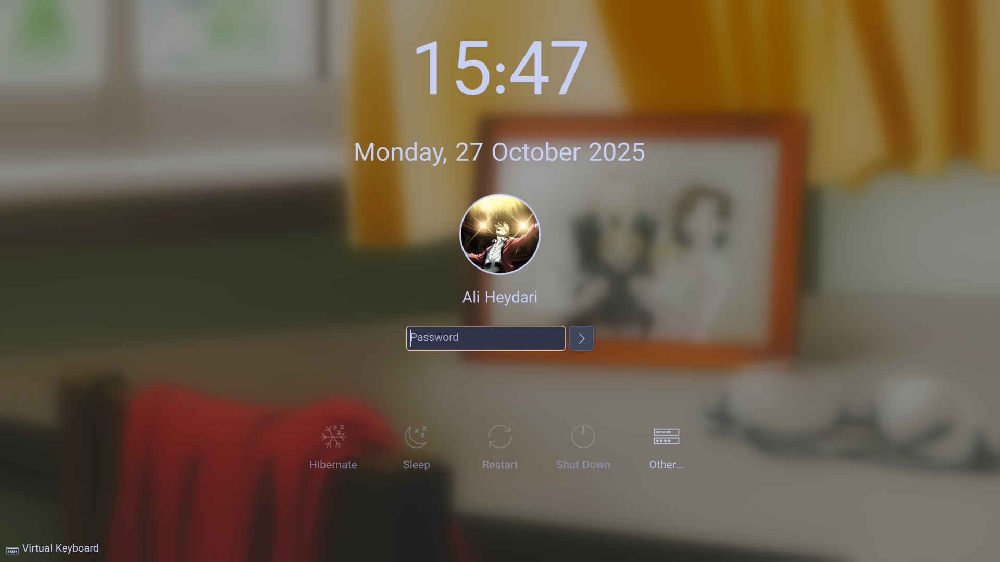
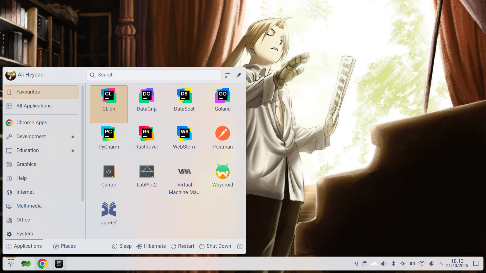
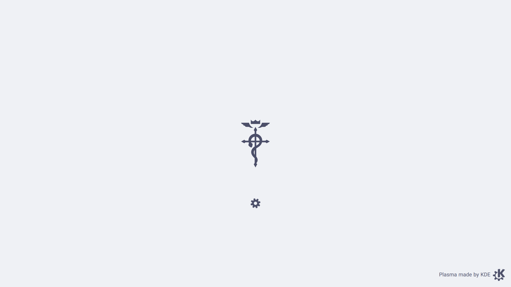
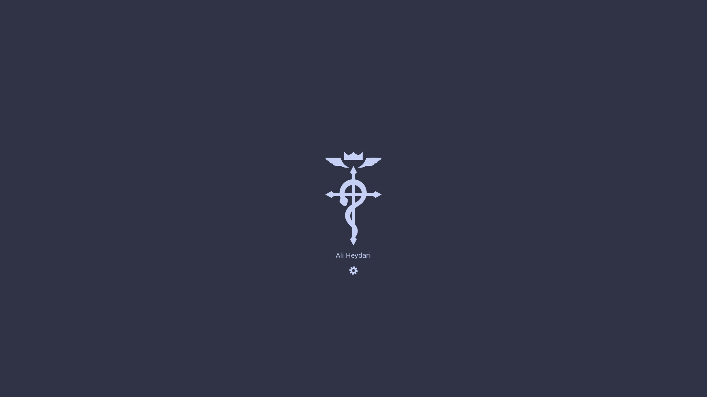

# FMA:B OS ❄️

Here you can find good stuff to copy-paste into your own personal NixOS configuration.

There's a custom theme that's consistent across KDE Plasma, SDDM, and even Plymouth.
You can personalize it by just replacing my wallpapers with anything you wish.

There's also a fairly comprehensive development environment for a variety of
programming languages, and lots of built-in software
(fully configured), and more.

🖼️ Dark mode

🖼️ Light mode

🖼️ Start up

## Main components 🫀

I tried my best to stick with KDE-native (or at least Qt6-native FOSS) apps,
unless they have a significant disadvantage.

  * GRUB bootloader
  * Plymouth
  * SDDM
  * KDE Plasma (Qt6) desktop environment on Wayland
  * Catppuccin pallete colours
  * Wave terminal emulator
  * Fish shell
  * Helix editor (CLI)
  * Zed editor (GUI)
  * VMMs (WinBoat for Windows, Waydroid for Android, and Virt-manager for
  everything else. They don't take much space unless they're initialized
  i.e. unless you download the OSes).
  * Ollama, Open WebUI, local Gemma and Qwen, with integrations for Zed IDE and Wave Terminal.
  * Development environment includes Rust, Go, C, C++, JS, Python, R, OCaml, and even Prolog,
  plus a JuPyteR env that also includes the R kernel and Python with a lot of data-scientific
  libs out of the box. JetBrains software include plugins ootb.
  * Lots of pre-installed software for music, image, and video playing and editing, and for
  academic purposes. (see the [list here](./configs/environment.nix)).
  * systemd, networkd, resolved, pipewire, btrfs filesystem, glibc, gnu coreutils,
  [core packages](https://nixos.org/manual/nixos/stable/options#opt-environment.corePackages),
  [default packages](https://nixos.org/manual/nixos/stable/options#opt-environment.defaultPackages),
  LTS kernel, etc.

A clean install takes ~110GiB disk space.

### Web app addresses 🧑‍💻

  * Flood is at [localhost:3000](http://localhost:3000/)
  * Stirling PDF is at [localhost:8080](http://localhost:8080/)
  * Open WebUI (for Ollama) is at [localhost:8085](http://localhost:8085/)
  * Jupyter Notebook is at [localhost:8888](http://localhost:8888/)
  * noVNC (for QEMU Windows) is at [localhost:8006](http://localhost:8006/)
  Note that it's only used for debugging and diagnostics. Windows apps are mainly
  accessed from the WinBoat app.

## Background images acknowledgements 🙌

Wallpaper by [cyph1n](https://www.deviantart.com/cyph1n/art/Restricted-Memories-Collaboration-494282818)

All images are taken from album covers of _Fullmetal Alchemist:
Brotherhood (Original Soundtrack)_ or the _Final Best_ BoxSet (which
includes singles for all 5 OPs and EDs), with some tweaks with the
help of KDE Krita (Photoshop alternative) and Google Gemini's Nano Banana.

I do not own these material.

All rights are reserved for their creators: Akira Senju (OST composer),
Sony Music Entertainment Japan (OST copyright holder), Milan Records
(OST distributor).

Characters & artwork by Hiromu Arakawa (manga artist), and Bones Inc.
(anime studio). Licensed by Crunchyroll from Sony Group Corporation,
and distributed in NA by Aniplex Inc.

## Future plans / TODO 🔮

  * Replacing BTRFS with BCacheFS.
  * Better starship prompts.
  * Move home-manager-managed stuff to global configs.
  * "Fixing" automatic theme switch for wave, nvim, helix, fish, starship, bat, fzf, lsd, and lazygit.
  * Using LXC for Windscribe.

## Alternatives / Competitors 🏅

  * [Nixy](https://github.com/anotherhadi/nixy) is based on Hyprland, with Caelestia-shell theme and
  Base16 colour pallete. It also features fully configured *arrs home media server. Check it out!
