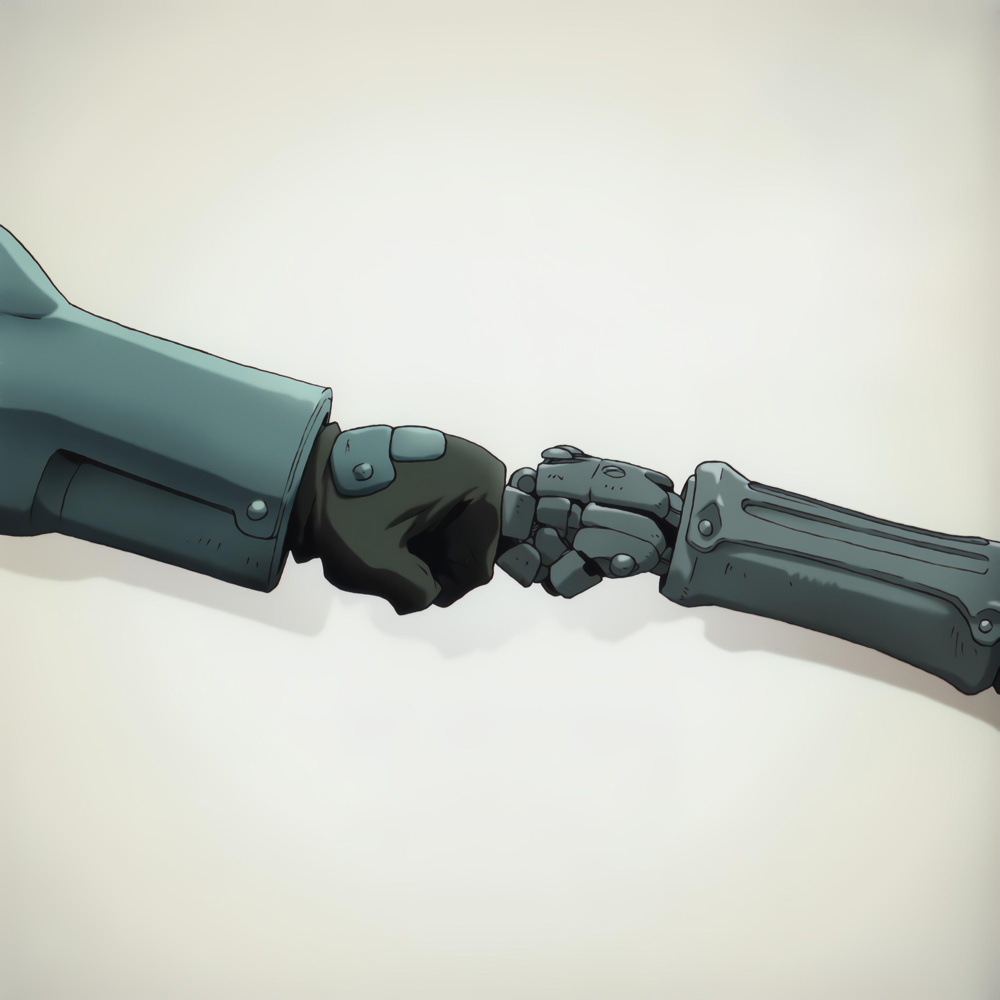

    

# FMA:B OS ❄️

A curated collection of high‑quality, ready‑to‑use components for building your own NixOS configuration.

This setup includes a cohesive custom theme applied across KDE Plasma, SDDM, and Plymouth.
You can easily personalize it by swapping in your own wallpapers.

It also provides a comprehensive development environment covering many programming languages,
a wide range of preconfigured software, and several virtualization options.

🖼️ Dark mode

🖼️ Light mode

🖼️ Start up

## Main components 🫀

I’ve tried to stick to KDE‑native (or at least Qt6‑native FOSS) applications
unless there was a strong reason not to.

  * **GRUB** bootloader
  * **Plymouth**
  * **SDDM**
  * **KDE Plasma** (Qt6) desktop environment on **Wayland**
  * **Catppuccin** colour palletes
  * **Wave** terminal emulator
  * **Fish** shell
  * **Helix** CLI editor
  * **Zed** GUI editor
  * **Virtualization:** Podman for containers, WinBoat for Windows, Waydroid for Android,
  and Virt-manager & systemd-nspawn for everything else.
  These take almost no space until initialized (i.e., until you download the guest OSes).
  * **Local AI:** Ollama, Jan AI, local Gemma and Qwen models, with integrations for Zed IDE
  and Wave Terminal.
  * **Development environment:** Rust, Go, C, C++, JS, Python, R, OCaml, and even Prolog,
  plus a JuPyteR env with Python and R kernels and many data-science libs preinstalled.
  JetBrains IDEs include plugins out of the box.
  * **Pre-installed software** for music, image, and video playing and editing, office work,
  and academic use. (see the [full list here](./configs/environment.nix)).
  * systemd, networkd, resolved, pipewire, btrfs filesystem, glibc,
  [core packages](https://nixos.org/manual/nixos/stable/options#opt-environment.corePackages),
  [default packages](https://nixos.org/manual/nixos/stable/options#opt-environment.defaultPackages),
  LTS kernel, etc.

A clean installation uses roughly 100GiB of disk space (+10GiB for local LLMs).

### Web app addresses 🧑‍💻

  * Flood is at [localhost:3000](http://localhost:3000/)
  * Stirling PDF is at [localhost:8080](http://localhost:8080/)
  * Jupyter Notebook is at [localhost:8888](http://localhost:8888/)
  * v2rayA at [localhost:2017](http://localhost:2017/)
  * noVNC (for QEMU Windows) is at [localhost:8006](http://localhost:8006/)
  noVNC is mainly used for debugging and diagnostics. Windows apps are normally accessed through
  the WinBoat app.

## Background image acknowledgements 🙌

Wallpaper by [cyph1n](https://www.deviantart.com/cyph1n/art/Restricted-Memories-Collaboration-494282818)

All images are sourced from album covers of _Fullmetal Alchemist:
Brotherhood (Original Soundtrack)_ and the _Final Best_ BoxSet (which
includes all 5 OP and ED singles).

Some light editing was done using KDE Krita and Google Gemini's Nano Banana.

I do not own these materials.

All rights belong to their respective creators: _Akira Senju_ (OST composer),
_Sony Music Entertainment Japan_ (OST copyright holder), _Milan Records_ (OST distributor).
Characters & artwork by _Hiromu Arakawa_ (manga artist), and _Bones Inc._ (anime studio).
Licensed by _Crunchyroll_ from Sony Group Corporation, and distributed in NA by _Aniplex Inc._

## Future plans / TODO 🔮

  * Migrate to `plasma-login-manager` once it becomes available on NixOS.
  * Replacing BTRFS with BCacheFS.
  * Using LXC for Windscribe.

## Alternatives / Competitors 🏅

  * [Nixy](https://github.com/anotherhadi/nixy) is based on Hyprland, with Caelestia-shell theme and
  Base16 colour pallete. It also includes a fully configured *arrs home media server. Check it out!
