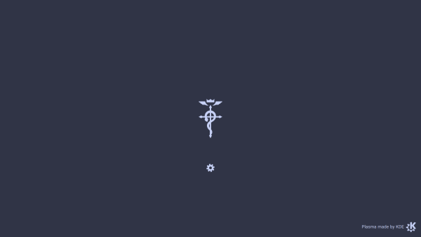

# FMA:B OS

My personal NixOS configuration.

This repo includes custom themes for GRUB, plymouth, SDDM, KDE Plasma, and desktop wallpapers.
This could be a decent base for you to use for your own custom themes.
It also includes lots of built-in software, and their configs.

<!---->

<!---->

<!---->

## Main components

I tried my best to stick with KDE-native (or at least Qt6-native FOSS) apps,
unless they have a significant disadvantage.

  * GRUB bootloader
  * Plymouth
  * SDDM
  * KDE Plasma (Qt6) desktop environment on Wayland
  * Catppuccin pallete colours
  * Wave terminal emulator
  * Fish shell
  * Helix editor (CLI)
  * Zed editor (GUI)
  * VMMs (WinBoat for Windows, Waydroid for Android, and Virt-manager for
  everything else. They don't take much space unless they're initialized
  i.e. unless you download the OSes).
  * Ollama, Open WebUI, local Gemma and Qwen, with integrations for Zed IDE and Wave Terminal.
  * systemd, networkd, resolved, pipewire, btrfs filesystem, glibc, gnu coreutils, LTS kernel, etc.

### Recommended Windows apps to install

  * Office 365 Pro Plus
  * Adobe Photoshop

### Web app addresses

  * Flood is at [localhost:3000](http://localhost:3000/)
  * Stirling PDF is at [localhost:8080](http://localhost:8080/)
  * Open WebUI (for Ollama) is at [localhost:8085](http://localhost:8085/)
  * noVNC (for QEMU Windows) is at [localhost:8006](http://localhost:8006/).
  Note that it's only used for debugging and diagnostics. Windows apps are mainly
  accessed from the WinBoat app.

## Background images acknowledgements

Wallpaper by [cyph1n](https://www.deviantart.com/cyph1n/art/Restricted-Memories-Collaboration-494282818)

All images are taken from album covers of _Fullmetal Alchemist:
Brotherhood (Original Soundtrack)_ or the _Final Best_ BoxSet (which
includes singles for all 5 OPs and EDs), with some tweaks with the
help of KDE Krita (Photoshop alternative) and Google Gemini's Nano Banana.

I do not own these material.

All rights are reserved for their creators: Akira Senju (OST composer),
Sony Music Entertainment Japan (OST copyright holder), Milan Records
(OST distributor).

Characters & artwork by Hiromu Arakawa (manga artist), and Bones Inc.
(anime studio). Licensed by Crunchyroll from Sony Group Corporation,
and distributed in NA by Aniplex Inc.

## Future plans / TODO

  * Better starship prompts.
  * Move home-manager-managed stuff to global configs.
  * "Fixing" automatic theme switch for wave, nvim, helix, fish, starship, bat, fzf, lsd, and lazygit.
