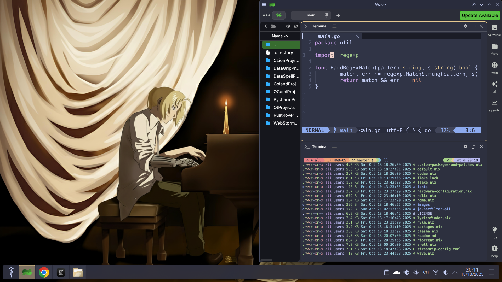
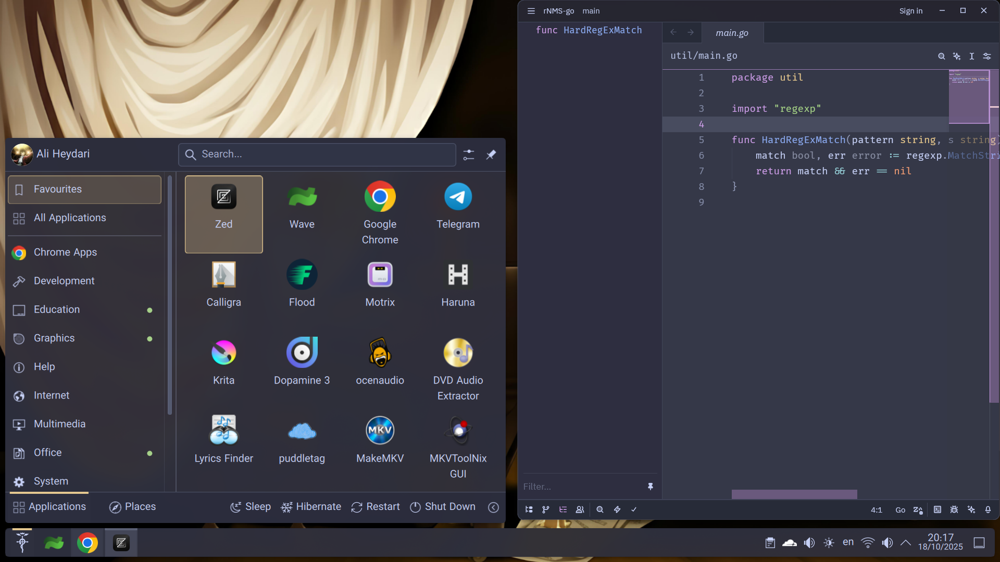

# FMA:B OS

My personal NixOS configuration.

## Main components

I tried my best to stick with KDE-native (or at least Qt6-native FOSS) apps,
unless they have a significant disadvantage.

  * Catppuccin themes
  * GRUB bootloader
  * KDE Plasma (Qt6) desktop environment with Wayland
  * SDDM (auto-login)
  * Wave terminal emulator
  * Fish shell
  * Helix editor (CLI)
  * Zed editor (GUI)
  * VMMs (WinBoat for Windows, Waydroid for Android, and Virt-manager for
  everything else. They don't take much space unless they're initialized
  i.e. unless you download the OSes).
  * systemd, networkd, resolved, pipewire, btrfs filesystem, glibc, gnu coreutils, LTS kernel, etc.

### Windows apps to install

  * Office 365 Pro Plus
  * Adobe Acrobat Pro DC
  * Adobe Photoshop

### Background images acknowledgements

All images are taken from album covers of _Fullmetal Alchemist:
Brotherhood (Original Soundtrack)_ or the _Final Best_ BoxSet (which
includes singles for all 5 OPs and EDs), with some tweaks with the
help of Photoshop and Google Gemini's Nano Banana.

I do not own these material.

All rights are reserved for their creators: Akira Senju (OST composer),
Sony Music Entertainment Japan (OST copyright holder), Milan Records
(OST distributor).

Characters & artwork by Hiromu Arakawa (manga artist), and Bones Inc.
(anime studio). Licensed by Crunchyroll from Sony Group Corporation,
and distributed in NA by Aniplex Inc.

Wallpaper by [cyph1n](https://www.deviantart.com/cyph1n/art/Restricted-Memories-Collaboration-494282818)
