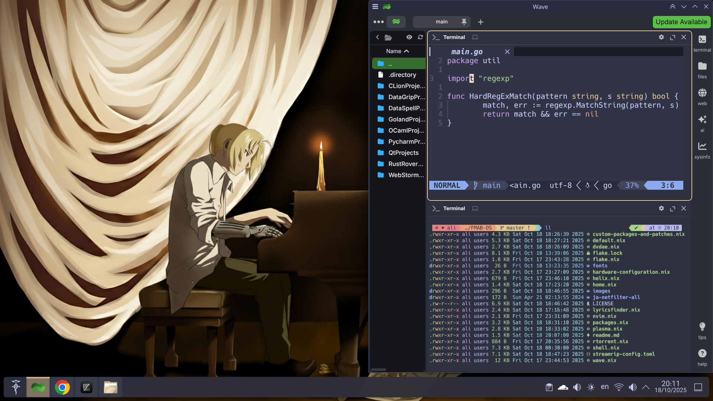
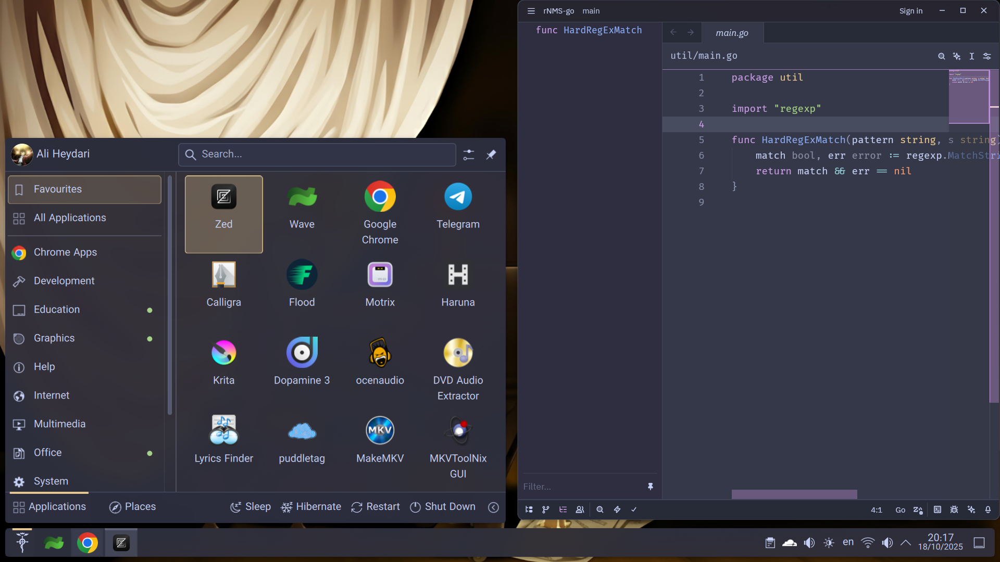
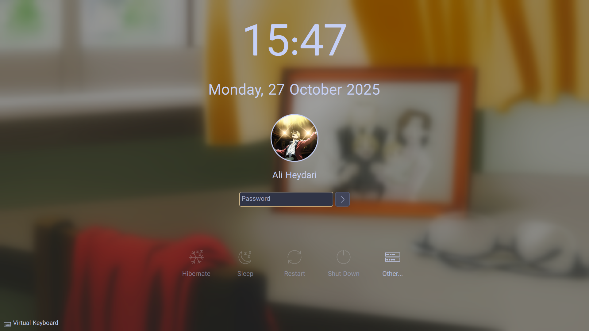
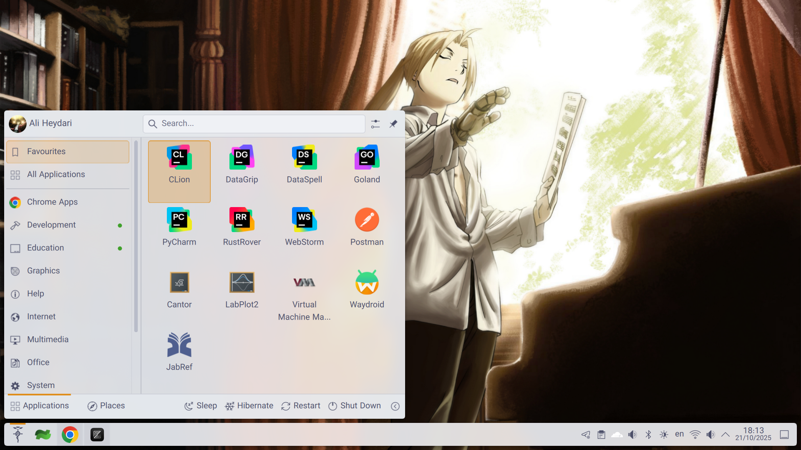
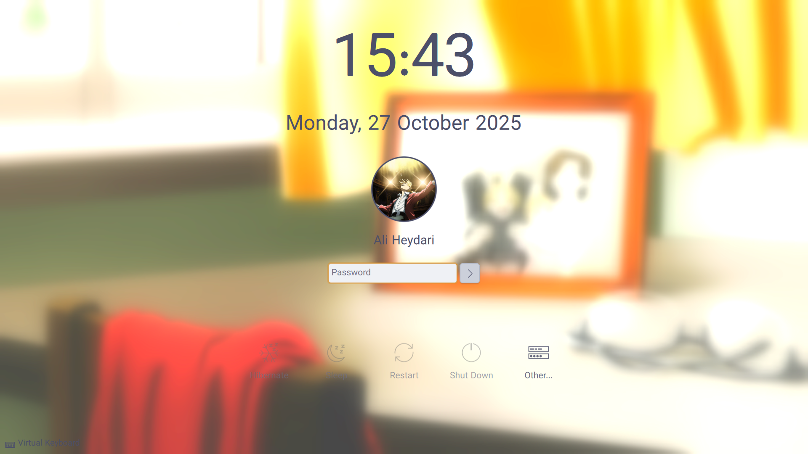
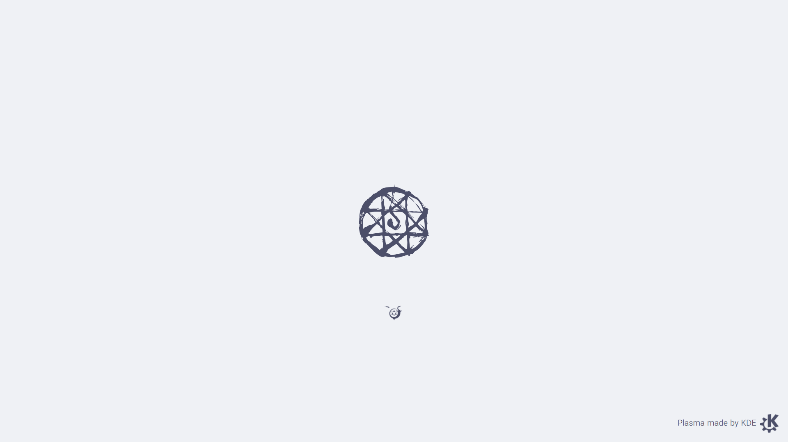
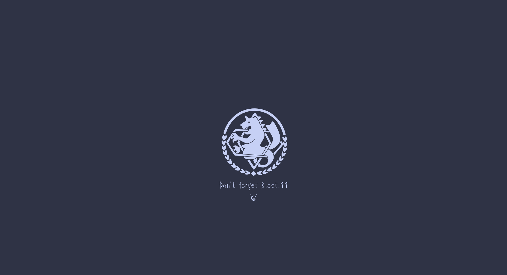

    

# FMA:B OS ❄️

A curated collection of high‑quality, ready‑to‑use components for building your own NixOS configuration.

This setup includes a cohesive custom theme applied across KDE Plasma and Plymouth.
You can easily personalize it by swapping in your own wallpapers.

It also provides a comprehensive development environment covering many programming languages,
a wide range of preconfigured software, and several virtualization options.

🖼️ Dark mode

🖼️ Light mode

🖼️ Start up

## Main components 🫀

I’ve tried to stick to KDE‑native (or at least Qt6‑native FOSS) applications
unless there was a strong reason not to.

  * **GRUB** bootloader
  * **Plymouth**
  * **KDE Plasma** (**Qt6**) desktop environment on **Wayland**,
  plus _Plasma Login Manager_ as the display manager
  * **Catppuccin** colour palletes
  * **Wave** terminal emulator
  * **Fish** shell with customized prompt using **Starship**
  * **Helix** CLI editor
  * **Zed** GUI editor
  * **Local AI:** Ollama, Jan AI, local Qwen models, with integrations for Zed IDE
  and Wave Terminal.
  * **Development environment:** Rust, Go, C, C++, JS, Python, R, OCaml, and even Prolog,
  plus a JuPyteR env with Python and R kernels and many data-science libs preinstalled.
  JetBrains IDEs include plugins out of the box.
  * **Pre-installed software** for music, image, and video playing and editing, office work,
  and academic use. (see the [full list here](./configs/system-wide/environment.nix)).
  * systemd, networkd, resolved, nftables, networkmanager, pipewire, btrfs filesystem, glibc,
  [core packages](https://nixos.org/manual/nixos/stable/options#opt-environment.corePackages),
  [default packages](https://nixos.org/manual/nixos/stable/options#opt-environment.defaultPackages),
  LTS kernel, etc.

A clean installation uses roughly 100GiB of disk space (+10GiB for local LLMs).

### Web app addresses 🧑‍💻

  * Flood is at [localhost:3000](http://localhost:3000/)
  * Jupyter Notebook is at [localhost:8888](http://localhost:8888/)
  * v2rayA at [localhost:2017](http://localhost:2017/)
  * noVNC (for QEMU Windows) is at [localhost:8006](http://localhost:8006/)
  noVNC is mainly used for debugging and diagnostics. Windows apps are normally accessed through
  the WinBoat app.

### Virtualization

  * Podman Desktop for containers
  * WinBoat for Windows
  * Waydroid for Android
  * Virt-manager for everything else
  * systemd-nspawn is also available.

Obviously, these take almost no space until initialized (i.e., until you download the guest OSes).

`~/Downloads` is shared from the host OS filesystem by default on WinBoat and Virt-manager.

To sync your host's clipboard with Virt-manager, you need to install `spice-vdagent` and `qemu-guest-agent`
on your guest OS.

I also recommend turning on OpenGL on Display SPICE in Virt-manager.

### Secondary DE

I have also added an additional Wayland compositors (window manager) just for fun.
To use it, open a secondary tty by `Ctrl`+`Alt`+`F2` or `F3`, and then type either
`niri-with-noctalia` or `niri-with-dms` to open Niri + Noctalia or Niri + DankMaterialShell.

## Background image acknowledgements 🙌

Wallpaper by [cyph1n](https://www.deviantart.com/cyph1n/art/Restricted-Memories-Collaboration-494282818)

All images are sourced from album covers of _Fullmetal Alchemist:
Brotherhood (Original Soundtrack)_ and the _Final Best_ BoxSet (which
includes all 5 OP and ED singles).

Some light editing was done using KDE Krita and Google Gemini's Nano Banana.

I do not own these materials.

All rights belong to their respective creators: _Akira Senju_ (OST composer),
_Sony Music Entertainment Japan_ (OST copyright holder), _Milan Records_ (OST distributor).
Characters & artwork by _Hiromu Arakawa_ (manga artist), and _Bones Inc._ (anime studio).
Licensed by _Crunchyroll_ from Sony Group Corporation, and distributed in NA by _Aniplex Inc._

## Future plans / TODO 🔮

  * Replacing BTRFS with BCacheFS.
  * `services.undervolt.enable`
  * Using LXC for Windscribe.

## Alternatives / Competitors 🏅

  * [Nixy](https://github.com/anotherhadi/nixy) is based on Hyprland, with Caelestia-shell theme and
  Base16 colour pallete. It also includes a fully configured *arrs home media server. Check it out!
